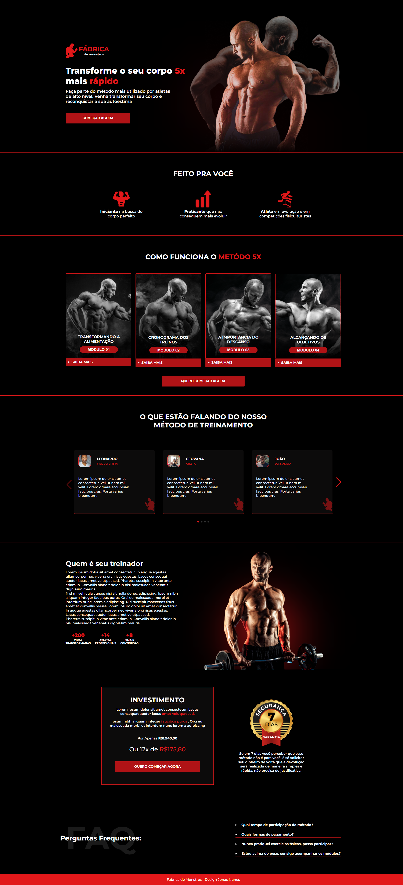

<h1 align="center"> Fabrica de Monstros </h1>

  <a href="#-tecnologias">Tecnologias</a>&nbsp;&nbsp;&nbsp;|&nbsp;&nbsp;&nbsp;
  <a href="#-projeto">Projeto</a>&nbsp;&nbsp;&nbsp;|&nbsp;&nbsp;&nbsp;
  <a href="#-layout">Layout</a>&nbsp;&nbsp;&nbsp;|&nbsp;&nbsp;&nbsp;
  <a href="#memo-licença">Licença</a>

  

 

## 🚀 Tecnologias

Esse projeto foi desenvolvido com as seguintes tecnologias:

- HTML
- SCSS
- Javascript

## 💻 Projeto

Um site para uma academia, totalmente responsivo

## 🔖 Layout

Você pode visualizar o layout do projeto através [DESSE LINK](https://www.figma.com/file/YQtNSfvAY36ch94ueKxhD0/F%C3%A1brica-de-Monstros?node-id=3%3A10&t=s555rq1mJv49wKG4-0). É necessário ter conta no [Figma](https://figma.com) para acessá-lo, feito pelo Designer(https://www.linkedin.com/in/jonas-nunes-a30b57138/).

## :memo: Licença

Esse projeto está sob a licença MIT.

---
